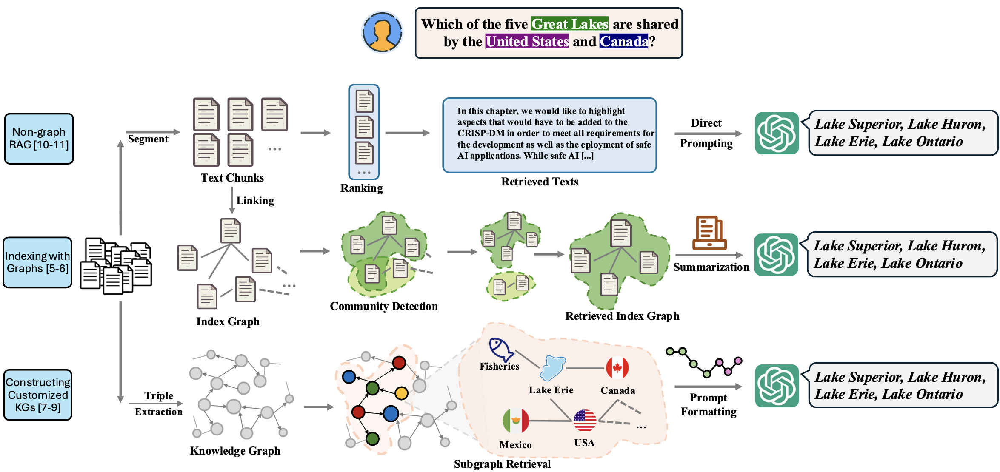

# Awesome-GraphRAG

<div align="center">
    <a href="https://awesome.re"></a>
    <a href="http://makeapullrequest.com"></a>
    <a href="http://makeapullrequest.com"></a>
</div>

Constructing: https://www.notion.so/GraphRAG-Survey-15999cbc17d2809e9bffd7ec26ba1458

This repository contains a curated list of resources on **graph-based retrieval-augmented generation (GraphRAG)**, which are classified according to our survey "[A Survey of Graph Retrieval-Augmented Generation for Customized Large Language Models]()".

*Continuously updating!*
<h1 align="center">
   <p align="center"></p>


## Table of Content
- [Research Papers](#research-papers)
    - [Knowledge Organization](#knowledge-organization)
        - [Graph for Knowledge Indexing](#graphs-for-knowledge-indexing)
        - [Graph as Knowledge Carrier](#graphs-as-knowledge-carrier)
            - [Knowledge Graph Construction from Corpus](#knowledge-graph-construction-from-corpus)
            - [GraphRAG with existing KGs](#graphrag-with-existing-kgs)
        - [Hybrid GraphRAG](#hybrid-graphrag)
    - [Knowledge Retrieval](#knowledge-retrieval)
        - [Semantics Similarity-based Retriever](#semantics-similarity-based-retriever)
        - [Logical Reasoning-based Retriever](#logical-reasoning-based-retriever)
        - [LLM-based Retriever](#llm-based-retriever)
        - [RL-based Retriever](#rl-based-retriever)
        - [GNN-based Retriever](#gnn-based-retriever)
    - [Knowledge Integration](#knowledge-integration)
        - [Fine-Tuning](#fine-tuning)
            - [Fine-Tuning with Node-Level Knowledge](#fine-tuning-with-node-level-knowledge)
            - [Fine-Tuning with Path-Level Knowledge](#fine-tuning-with-path-level-knowledge)
            - [Fine-Tuning with Subgraph-Level Knowledge](#fine-tuning-with-subgraph-level-knowledge)
        - [In-Context Learning](#in-context-learning)
            - [Graph-Enhanced Chain-of-Thought](#graph-enhanced-chain-of-thought)
            - [Collaborative Knowledge Graph Refinement](#collaborative-knowledge-graph-refinement)
- [Related Survey Papers](#related-survey-papers)
- [Open-Source Projects](#open-source-projects)
- [Benchmarks](#benchmarks)
- [Citation](#citation)


# Research Papers
## Knowledge Organization
### Graphs for Knowledge Indexing
- (ArXiv 2024) **Graph Neural Network Enhanced Retrieval for Question Answering of LLMs** [[Paper]](https://arxiv.org/abs/2406.06572)
- (ArXiv 2024) **Empowering Large Language Models to Set up a Knowledge Retrieval Indexer via Self-Learning** [[Paper]](https://arxiv.org/abs/2405.16933)
- (AAAI 2024) **Knowledge graph prompting for multi-document question answering** [[Paper]](https://www.overleaf.com/project/667419080bc7191bc75f5880)
- (ArXiv 2024) **GraphCoder: Enhancing Repository-Level Code Completion via Code Context Graph-based Retrieval and Language Model** [[Paper]](https://arxiv.org/abs/2406.07003)
- (NeurIPS 2023) **Avis: Autonomous visual information seeking with large language model agent** [[Paper]](https://openreview.net/forum?id=7EMphtUgCI&noteId=yGw4rbGozi)
- (ArXiv 2020) **Answering complex open-domain questions with multi-hop dense retrieval** [[Paper]](https://arxiv.org/abs/2009.12756)
- (ArXiv 2019) **Knowledge guided text retrieval and reading for open domain question answering** [[Paper]](https://arxiv.org/abs/1911.03868)
- (CoRL 2023) **Sayplan: Grounding large language models using 3d scene graphs for scalable robot task planning** [[Paper]](https://proceedings.mlr.press/v229/rana23a/rana23a.pdf)
### Graphs as Knowledge Carrier
#### Knowledge Graph Construction from Corpus
- (EMNLP 2024 )**Structure Guided Prompt: Instructing Large Language Model in Multi-Step Reasoning by Exploring Graph Structure of the Text** [[Paper]](https://aclanthology.org/2024.emnlp-main.528.pdf)
- (ACL 2019) **Using Local Knowledge Graph Construction to Scale Seq2Seq Models to Multi-Document Inputs** [[Paper]](https://aclanthology.org/D19-1428.pdf)
- (BigData 2023) **AutoKG: Efficient automated knowledge graph generation for language models** [[Paper]](https://ieeexplore.ieee.org/abstract/document/10386454)
- (SIGIR 2019) **Answering complex questions by joining multi-document evidence with quasi knowledge graphs** [[Paper]](https://dl.acm.org/doi/10.1145/3331184.3331252)
- (Arxiv 2024) **From local to global: A graph rag approach to query-focused summarization** [[Paper]](https://arxiv.org/abs/2404.16130)
- (EMNLP Finding 2024) **GraphReader: Building Graph-based Agent to Enhance Long-Context Abilities of Large Language Models** [[Paper]](https://aclanthology.org/2024.findings-emnlp.746/)
- (SIGIR 2024) **Retrieval-augmented generation with knowledge graphs for customer service question answering** [[Paper]](https://dl.acm.org/doi/abs/10.1145/3626772.3661370)
#### GraphRAG with existing KGs
- (Arxiv 2024)**StructRAG: Boosting Knowledge Intensive Reasoning of LLMs via Inference-time Hybrid Information Structurization** [[Paper]](https://arxiv.org/abs/2410.08815)
- (ICLR 2024) **Reasoning on Graphs: Faithful and Interpretable Large Language Model Reasoning** [[Paper]](https://openreview.net/forum?id=ZGNWW7xZ6Q)
- (AAAI 2024) **Mitigating large language model hallucinations via autonomous knowledge graph-based retrofitting** [[Paper]](https://dl.acm.org/doi/10.1609/aaai.v38i16.29770)
- (ICLR 2024) **Think-on-Graph: Deep and Responsible Reasoning of Large Language Model on Knowledge Graph** [[Paper]](https://openreview.net/forum?id=nnVO1PvbTv)
- (Bioinformatics 2024) **Biomedical knowledge graph-enhanced prompt generation for large language models** [[Paper]](https://academic.oup.com/bioinformatics/article/40/9/btae560/7759620)
- (NeurIPS 2024) **KnowGPT: Knowledge Graph based PrompTing for Large Language Models** [[Paper]](https://openreview.net/forum?id=PacBluO5m7&referrer=%5Bthe%20profile%20of%20Daochen%20Zha%5D(%2Fprofile%3Fid%3D~Daochen_Zha1))
- (ACL Finding 2024)**Knowledge Graph-Enhanced Large Language Models via Path Selection** [[Paper]](https://aclanthology.org/2024.findings-acl.376/)
- (Arxiv 2024) **Simple is Effective: The Roles of Graphs and Large Language Models in Knowledge-Graph-Based Retrieval-Augmented Generation** [[Paper]](https://arxiv.org/abs/2410.20724)
- (CoLM 2024) **ProLLM: Protein Chain-of-Thoughts Enhanced LLM for Protein-Protein Interaction Prediction** [[Paper]](https://openreview.net/forum?id=2nTzomzjjb#discussion)
- (Arxiv 2024) **Think-on-Graph 2.0: Deep and Faithful Large Language Model Reasoning with Knowledge-guided Retrieval Augmented Generation** [[Paper]](https://arxiv.org/abs/2407.10805)
### Hybrid GraphRAG
- (Arxiv 2024) **Graph of Records: Boosting Retrieval Augmented Generation for Long-context Summarization with Graphs** [[Paper]](https://arxiv.org/abs/2410.11001)
- (Arxiv 2024) **Medical graph rag: Towards safe medical large language model via graph retrieval-augmented generation** [[Paper]](https://arxiv.org/abs/2408.04187)
- (Arxiv 2024) **Codexgraph: Bridging large language models and code repositories via code graph databases** [[Paper]](https://arxiv.org/abs/2408.03910)
## Knowledge Retrieval

### Semantics Similarity-based Retriever

### Logical Reasoning-based Retriever

### LLM-based Retriever

### RL-based Retriever

### GNN-based Retriever

## Knowledge Integration
### Fine-Tuning
#### Fine-Tuning with Node-Level Knowledge
- (Arxiv 2025) Large Language Models based Graph Convolution for Text-Attributed Networks? [[Paper]](https://openreview.net/forum?id=x5FfUvsLIE)
- (SIGIR 2024) Graphgpt: Graph instruction tuning for large language models [[Paper]](https://dl.acm.org/doi/10.1145/3626772.3657775)
#### Fine-Tuning with Path-Level Knowledge
- (AAAI 2024) Exploring large language model for graph data understanding in online job recommendations [[Paper]](https://dl.acm.org/doi/10.1609/aaai.v38i8.28769)
- (WWW 2023) Structure pretraining and prompt tuning for knowledge graph transfer [[Paper]](https://dl.acm.org/doi/10.1145/3543507.3583301)
- (Arxiv 2024) MuseGraph: Graph-oriented Instruction Tuning of Large Language Models for Generic Graph Mining [[Paper]](https://arxiv.org/pdf/2403.04780)
- (ICLR 2023) Reasoning on graphs: Faithful and interpretable large language model reasoning [[Paper]](https://openreview.net/forum?id=ZGNWW7xZ6Q)
#### Fine-Tuning with Subgraph-Level Knowledge
- (ICML 2024) Llaga: Large language and graph assistant [[Paper]](https://openreview.net/pdf?id=B48Pzc4oKi)
- (KDD 2024) Graphwiz: An instruction-following language model for graph problems [[Paper]](https://graph-wiz.github.io/)
- (AAAI 2024) Graph neural prompting with large language models [[Paper]](https://dl.acm.org/doi/10.1609/aaai.v38i17.29875)
- (ACL 2024) Rho:Reducing hallucination in open-domain dialogues with knowledge
grounding [[Paper]](https://aclanthology.org/2023.findings-acl.275/)
- (EACL 2024) language is all a graph needs [[Paper]](https://aclanthology.org/2024.findings-eacl.132.pdf)
### In-Context Learning
#### Graph-Enhanced Chain-of-Thought

#### Collaborative Knowledge Graph Refinement

# Related Survey Papers
(Arxiv 2025) **A Survey of Graph Retrieval-Augmented Generation for Customized Large Language Models** [[Paper]]() 

(Arxiv 2024) **Graph Retrieval-Augmented Generation: A Survey** [[Paper]](https://arxiv.org/pdf/2408.08921)

(AIxSET 2024) **Graph Retrieval-Augmented Generation for Large Language Models: A Survey** [[Paper]](https://papers.ssrn.com/sol3/Delivery.cfm?abstractid=4895062)

# Open-Source Projects

# Benchmarks


# Citation
```

```
