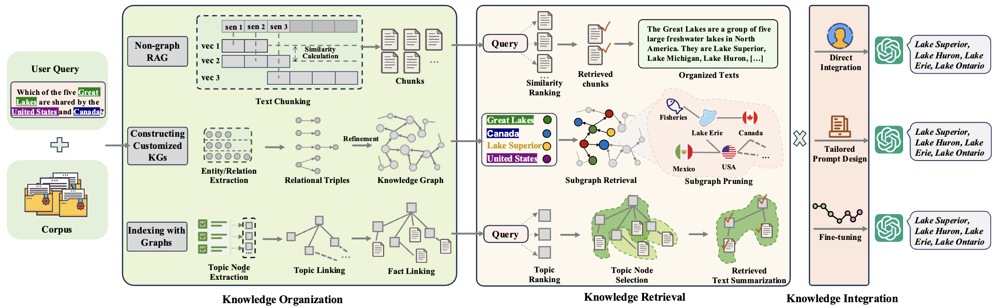
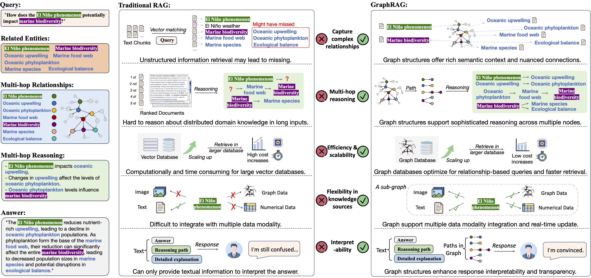
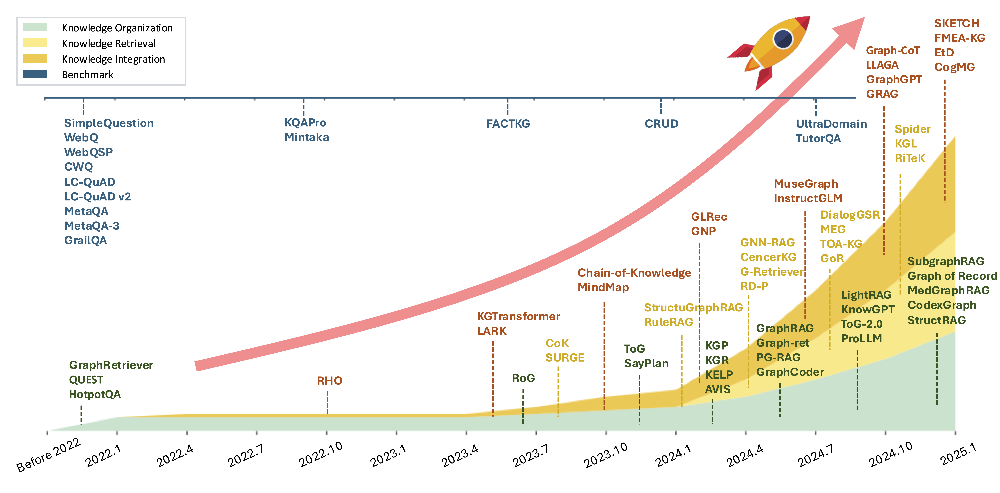

# Awesome-GraphRAG (GraphRAG Survey)

<div align="center">
    <a href="https://awesome.re"></a>
    <a href="http://makeapullrequest.com"></a>
    <a href="http://makeapullrequest.com"></a>
    <a href="http://makeapullrequest.com"></a>
      <a href="http://makeapullrequest.com"></a>
</div>


This repository contains a curated list of resources on graph-based retrieval-augmented generation (GraphRAG), which are classified according to "[**A Survey of Graph Retrieval-Augmented Generation for Customized Large Language Models**](https://arxiv.org/abs/2501.13958)". Continuously updating, stay tuned!

<div>
<h3 align="left">
       <p align="center"></p>
    <p align="center"><em>Overview of traditional RAG and two typical GraphRAG workflows. </em></p>
</div>

- **Non-graph RAG** organizes the
corpus into chunks, ranks them by similarity, and retrieves the most relevant text for generating responses.
- **Knowledge-based
GraphRAG** extracts detailed knowledge graphs from the corpus using entity recognition and relation extraction, offering
fine-grained, domain-specific information.
- **Index-based GraphRAG** summarizes the corpus into high-level topic nodes, which
are linked to form an index graph, while the fact linking maps topics to text.

---

# RAG vs. GraphRAG
GraphRAG is a new paradigm of RAG that revolutionizes domain-specific LLM applications, by addressing traditional RAG limitations through three key innovations: **(i) graph-structured knowledge representation** that explicitly captures
entity relationships and domain hierarchies, **(ii) graph-aware retrieval mechanisms** that enable multi-hop reasoning and context-preserving knowledge acquisition, and **(iii) structure-guided
knowledge search algorithms** that ensure efficient retrieval across large-scale corpora.
    

<h3 align="center">
   <p align="center"></p>
    <p align="center"><em>Comparison between traditional RAG and GraphRAG.</em></p>


# 📫 Contact Us
We welcome researchers to share related work to enrich this list or provide insightful comments on our survey. Feel free to reach out to the corresponding co-first authors: [Qinggang Zhang](https://qing145.github.io/), [Shengyuan Chen](https://chensycn.github.io/).


## Table of Content
- [📫 Contact Us](#-contact-us)
- [📈 Trend of GraphRAG Research](#-trend-of-graphrag-research)
- [📜 Research Papers](#-research-papers)
    - [Knowledge Organization](#knowledge-organization)
        - [Graph for Knowledge Indexing](#graphs-for-knowledge-indexing)
        - [Graph as Knowledge Carrier](#graphs-as-knowledge-carrier)
            - [Knowledge Graph Construction from Corpus](#knowledge-graph-construction-from-corpus)
            - [GraphRAG with Existing KGs](#graphrag-with-existing-kgs)
        - [Hybrid GraphRAG](#hybrid-graphrag)
    - [Knowledge Retrieval](#knowledge-retrieval)
        - [Semantics Similarity-based Retriever](#semantics-similarity-based-retriever)
        - [Logical Reasoning-based Retriever](#logical-reasoning-based-retriever)
        - [LLM-based Retriever](#llm-based-retriever)
        - [GNN-based Retriever](#gnn-based-retriever)
        - [Multi-round Retriever](#multi-round-retriever)
        - [Post-retrieval](#post-retrieval)
        - [Hybrid Retriever](#hybrid-retriever)
    - [Knowledge Integration](#knowledge-integration)
        - [Fine-tuning](#fine-tuning)
            - [Fine-tuning with Node-level Knowledge](#fine-tuning-with-node-level-knowledge)
            - [Fine-tuning with Path-level Knowledge](#fine-tuning-with-path-level-knowledge)
            - [Fine-tuning with Subgraph-level Knowledge](#fine-tuning-with-subgraph-level-knowledge)
        - [In-context Learning](#in-context-learning)
            - [Graph-enhanced Chain-of-Thought](#graph-enhanced-chain-of-thought)
            - [Collaborative Knowledge Graph Refinement](#collaborative-knowledge-graph-refinement)
- [📚 Related Survey Papers](#-related-survey-papers)
- [🏆 Benchmarks](#-benchmarks)
- [💻 Open-source Projects](#-open-source-projects)
- [🍀 Citation](#-citation)
- [⭐ Star History](#-star-history)


# 📈 Trend of GraphRAG Research

<h3 align="center">
   <p align="center"></p>
    <p align="center"><em>The development trends in the field of GraphRAG with representative works.</em></p>

# 📜 Research Papers
## Knowledge Organization

### Graphs for Knowledge Indexing
- (arXiv 2025) **DIGIMON: A unified and modular graph-based RAG framework** [[Paper]](https://github.com/JayLZhou/GraphRAG.git)
- (arXiv 2025) **ArchRAG: Attributed Community-based Hierarchical Retrieval-Augmented Generation** [[Paper]](https://arxiv.org/abs/2502.09891)
- (arXiv 2025) **KET-RAG: A Cost-Efficient Multi-Granular Indexing Framework for Graph-RAG** [[Paper]](https://arxiv.org/abs/2502.09304)
- (arXiv 2025) **PIKE-RAG: sPecIalized KnowledgE and Rationale Augmented Generation** [[Paper]](https://arxiv.org/abs/2501.11551)
- (arXiv 2025) **Retrieval-Augmented Generation with Hierarchical Knowledge** [[Paper]](https://arxiv.org/abs/2503.10150)
- (arXiv 2024) **Graph Neural Network Enhanced Retrieval for Question Answering of LLMs** [[Paper]](https://arXiv.org/abs/2406.06572)
- (arXiv 2024) **KAG: Boosting LLMs in Professional Domains via Knowledge Augmented Generation** [[Paper]](https://arxiv.org/abs/2409.13731)
- (arXiv 2024) **OG-RAG: Ontology-Grounded Retrieval-Augmented Generation For Large Language Models** [[Paper]](https://arxiv.org/abs/2412.15235)
- (arXiv 2024) **GRAG: Graph Retrieval-Augmented Generation** [[Paper]](https://arxiv.org/abs/2405.16506)
- (arXiv 2024) **Empowering Large Language Models to Set up a Knowledge Retrieval Indexer via Self-Learning** [[Paper]](https://arXiv.org/abs/2405.16933)
- (ICLR 2024) **RAPTOR: Recursive Abstractive Processing for Tree-Organized Retrieval** [[Paper]](https://arxiv.org/abs/2401.18059)
- (AAAI 2024) **Knowledge graph prompting for multi-document question answering** [[Paper]](https://www.overleaf.com/project/667419080bc7191bc75f5880)
- (arXiv 2024) **GraphCoder: Enhancing Repository-Level Code Completion via Code Context Graph-based Retrieval and Language Model** [[Paper]](https://arXiv.org/abs/2406.07003)
- (NeurIPS 2023) **Avis: Autonomous visual information seeking with large language model agent** [[Paper]](https://openreview.net/forum?id=7EMphtUgCI&noteId=yGw4rbGozi)
- (CoRL 2023) **Sayplan: Grounding large language models using 3d scene graphs for scalable robot task planning** [[Paper]](https://proceedings.mlr.press/v229/rana23a/rana23a.pdf)
- (arXiv 2020) **Answering complex open-domain questions with multi-hop dense retrieval** [[Paper]](https://arXiv.org/abs/2009.12756)
- (arXiv 2019) **Knowledge guided text retrieval and reading for open domain question answering** [[Paper]](https://arXiv.org/abs/1911.03868)

### Graphs as Knowledge Carrier
#### Knowledge Graph Construction from Corpus
- (arXiv 2025) **Retrieval-Augmented Generation with Hierarchical Knowledge** [[Paper]](https://arxiv.org/abs/2503.10150)
- (arXiv 2025) **MedRAG: Enhancing Retrieval-augmented Generation with Knowledge Graph-Elicited Reasoning for Healthcare Copilot** [[Paper]](https://arxiv.org/abs/2502.04413)
- (arXiv 2025) **PathRAG: Pruning Graph-based Retrieval Augmented Generation with Relational Paths** [[Paper]](https://arxiv.org/abs/2502.14902)
- (arXiv 2024) **From local to global: A graph rag approach to query-focused summarization** [[Paper]](https://arXiv.org/abs/2404.16130)
- (EMNLP 2024) **Structure Guided Prompt: Instructing Large Language Model in Multi-Step Reasoning by Exploring Graph Structure of the Text** [[Paper]](https://aclanthology.org/2024.emnlp-main.528.pdf)
- (EMNLP 2024 Findings) **GraphReader: Building Graph-based Agent to Enhance Long-Context Abilities of Large Language Models** [[Paper]](https://aclanthology.org/2024.findings-emnlp.746/)
- (SIGIR 2024) **Retrieval-augmented generation with knowledge graphs for customer service question answering** [[Paper]](https://dl.acm.org/doi/abs/10.1145/3626772.3661370)
- (arXiv 2024) **DynaGRAG | Exploring the Topology of Information for Advancing Language Understanding and Generation in Graph Retrieval-Augmented Generation** [[Paper]](https://arxiv.org/abs/2412.18644)
- (arXiv 2024) **FastRAG: Retrieval Augmented Generation for Semi-structured Data** [[Paper]](https://arxiv.org/abs/2411.13773)
- (TechRxiv 2024) **LuminiRAG: Vision-Enhanced Graph RAG for Complex Multi-Modal Document Understanding** [[Paper]](https://www.techrxiv.org/users/867713/articles/1248304-luminirag-vision-enhanced-graph-rag-for-complex-multi-modal-document-understanding)
- (BigData 2023) **AutoKG: Efficient automated knowledge graph generation for language models** [[Paper]](https://ieeexplore.ieee.org/abstract/document/10386454)
- (ACL 2019) **Using Local Knowledge Graph Construction to Scale Seq2Seq Models to Multi-Document Inputs** [[Paper]](https://aclanthology.org/D19-1428.pdf)
- (SIGIR 2019) **Answering complex questions by joining multi-document evidence with quasi knowledge graphs** [[Paper]](https://dl.acm.org/doi/10.1145/3331184.3331252)

#### GraphRAG with Existing KGs
- (AAAI 2025) **LightPROF: A Lightweight Reasoning Framework for Large Language Model on Knowledge Graph** [[Paper]](https://arxiv.org/abs/2504.03137)
- (ICLR 2025) **Simple is Effective: The Roles of Graphs and Large Language Models in Knowledge-Graph-Based Retrieval-Augmented Generation** [[Paper]](https://openreview.net/forum?id=JvkuZZ04O7)
- (arXiv 2025) **Empowering GraphRAG with Knowledge Filtering and Integration** [[Paper]](https://arxiv.org/abs/2503.13804)
- (arXiv 2024)**StructRAG: Boosting Knowledge Intensive Reasoning of LLMs via Inference-time Hybrid Information Structurization** [[Paper]](https://arXiv.org/abs/2410.08815)
- (ICLR 2024) **Reasoning on Graphs: Faithful and Interpretable Large Language Model Reasoning** [[Paper]](https://openreview.net/forum?id=ZGNWW7xZ6Q)
- (AAAI 2024) **Mitigating large language model hallucinations via autonomous knowledge graph-based retrofitting** [[Paper]](https://dl.acm.org/doi/10.1609/aaai.v38i16.29770)
- (ICLR 2024) **Think-on-Graph: Deep and Responsible Reasoning of Large Language Model on Knowledge Graph** [[Paper]](https://openreview.net/forum?id=nnVO1PvbTv)
- (Bioinformatics 2024) **Biomedical knowledge graph-enhanced prompt generation for large language models** [[Paper]](https://academic.oup.com/bioinformatics/article/40/9/btae560/7759620)
- (NeurIPS 2024) **KnowGPT: Knowledge Graph based PrompTing for Large Language Models** [[Paper]](https://openreview.net/forum?id=PacBluO5m7&referrer=%5Bthe%20profile%20of%20Daochen%20Zha%5D(%2Fprofile%3Fid%3D~Daochen_Zha1))
- (ACL 2024 Findings) **Knowledge Graph-Enhanced Large Language Models via Path Selection** [[Paper]](https://aclanthology.org/2024.findings-acl.376/)
- (IEEE VIS 2024) **KNOWNET: Guided Health Information Seeking from LLMs via Knowledge Graph Integration** [[Paper]](https://arxiv.org/abs/2407.13598)
- (CoLM 2024) **ProLLM: Protein Chain-of-Thoughts Enhanced LLM for Protein-Protein Interaction Prediction** [[Paper]](https://openreview.net/forum?id=2nTzomzjjb#discussion)
- (arXiv 2024) **LEGO-GraphRAG: Modularizing Graph-based Retrieval-Augmented Generation for Design Space Exploration** [[Paper]](https://arxiv.org/abs/2411.05844)
- (arXiv 2024) **Think-on-Graph 2.0: Deep and Faithful Large Language Model Reasoning with Knowledge-guided Retrieval Augmented Generation** [[Paper]](https://arXiv.org/abs/2407.10805)

### Hybrid GraphRAG
- (NAACL 2025) **Knowledge Graph-Guided Retrieval Augmented Generation** [[Paper]](https://arxiv.org/abs/2502.06864)
- (ACL 2024 Findings) **HybGRAG: Hybrid Retrieval-Augmented Generation on Textual and Relational Knowledge Bases**[[Paper]](https://arxiv.org/abs/2412.16311)
- (arXiv 2024) **Graph of Records: Boosting Retrieval Augmented Generation for Long-context Summarization with Graphs** [[Paper]](https://arXiv.org/abs/2410.11001)
- (arXiv 2024) **Medical graph rag: Towards safe medical large language model via graph retrieval-augmented generation** [[Paper]](https://arXiv.org/abs/2408.04187)
- (arXiv 2024) **Codexgraph: Bridging large language models and code repositories via code graph databases** [[Paper]](https://arXiv.org/abs/2408.03910)

## Knowledge Retrieval

### Semantics Similarity-based Retriever
- (AAAI 2024) **StructuGraphRAG: Structured Document-Informed Knowledge Graphs for Retrieval-Augmented Generation** [[Paper]](https://ojs.aaai.org/index.php/AAAI-SS/article/view/31798/33965)
- (arXiv 2024) **G-Retriever: Retrieval-Augmented Generation for Textual Graph Understanding and Question Answering** [[Paper]](https://arXiv.org/abs/2402.07630)
- (arXiv 2024) **CancerKG.ORG A Web-scale, Interactive, Verifiable Knowledge Graph-LLM Hybrid for Assisting with Optimal Cancer Treatment and Care** [[Paper]](https://arXiv.org/abs/2501.00223)
- (arXiv 2024) **Empowering Large Language Models to Set up a Knowledge Retrieval Indexer via Self-Learning** [[Paper]](https://arXiv.org/abs/2405.16933)
- (arXiv 2024) **GraphCoder: Enhancing Repository-Level Code Completion via Code Context Graph-based Retrieval and Language Model** [[Paper]](https://arXiv.org/abs/2406.07003)
- (arXiv 2024) **Medical Graph RAG: Towards Safe Medical Large Language Model via Graph Retrieval-Augmented Generation** [[Paper]](https://arXiv.org/abs/2408.04187)
- (arXiv 2024) **How to Make LLMs Strong Node Classifiers?** [[Paper]](https://arxiv.org/abs/2410.02296)

### Logical Reasoning-based Retriever
- (NeurIPS 2024) **KnowGPT: Knowledge Graph based PrompTing for Large Language Models** [[Paper]](https://openreview.net/forum?id=PacBluO5m7&referrer=%5Bthe%20profile%20of%20Daochen%20Zha%5D(%2Fprofile%3Fid%3D~Daochen_Zha1))
- (ACL 2024 Findings) **Knowledge Graph-Enhanced Large Language Models via Path Selection** [[Paper]](https://aclanthology.org/2024.findings-acl.376/)
- (ICLR 2024) **Think-on-Graph: Deep and Responsible Reasoning of Large Language Model on Knowledge Graph** [[Paper]](https://openreview.net/forum?id=nnVO1PvbTv)
- (CIKM 2024) **RD-P: A Trustworthy Retrieval-Augmented Prompter with Knowledge Graphs for LLMs** [[Paper]](https://dl.acm.org/doi/10.1145/3627673.3679659)
- (arXiv 2024) **RuleRAG: Rule-Guided Retrieval-Augmented Generation with Language Models for Question Answering** [[Paper]](https://arXiv.org/abs/2410.22353)
- (LHB 2024) **Intelligent question answering for water conservancy project inspection driven by knowledge graph and large language model collaboration** [[Paper]](https://www.tandfonline.com/doi/full/10.1080/27678490.2024.2397337)
- (arXiv 2024) **RiTeK: A Dataset for Large Language Models Complex Reasoning over Textual Knowledge Graphs** [[Paper]](https://arXiv.org/abs/2410.13987)

### LLM-based Retriever
- (AAAI 2024) **Knowledge graph prompting for multi-document question answering** [[Paper]](https://www.overleaf.com/project/667419080bc7191bc75f5880)
- (EMNLP 2024) **Structure Guided Prompt: Instructing Large Language Model in Multi-Step Reasoning by Exploring Graph Structure of the Text** [[Paper]](https://aclanthology.org/2024.emnlp-main.528.pdf)
- (ACML 2024) **Enhancing Textbook Question Answering with Knowledge Graph-Augmented Large Language Models** [[Paper]](https://openreview.net/forum?id=ATiIqCCqR2)
- (ICLR 2024) **Think-on-Graph: Deep and Responsible Reasoning of Large Language Model on Knowledge Graph** [[Paper]](https://arXiv.org/abs/2307.07697)
- (arXiv 2024) **LightRAG: Simple and Fast Retrieval-Augmented Generation** [[Paper]](https://arXiv.org/abs/2410.05779)
- (arXiv 2024) **MEG: Medical Knowledge-Augmented Large Language Models for Question Answering** [[Paper]](https://arXiv.org/abs/2411.03883)
- (arXiv 2024) **From local to global: A graph rag approach to query-focused summarization** [[Paper]](https://arXiv.org/abs/2404.16130)

### GNN-based Retriever
- (arXiv 2025) **CG-RAG: Research Question Answering by Citation Graph Retrieval-Augmented LLMs** [[Paper]](https://arxiv.org/abs/2501.15067)
- (arXiv 2024) **Advanced RAG Models with Graph Structures: Optimizing Complex Knowledge Reasoning and Text Generation** [[Paper]](https://arXiv.org/abs/2411.03572)
- (arXiv 2024) **Language Models are Graph Learners** [[Paper]](https://arxiv.org/abs/2410.02296)
- (arXiv 2024) **Graph Neural Network Enhanced Retrieval for Question Answering of LLMs** [[Paper]](https://arXiv.org/abs/2406.06572)
- (arXiv 2024) **Knowledge Graph-Augmented Language Models for Knowledge-Grounded Dialogue Generation** [[Paper]](https://arXiv.org/abs/2305.18846)


### Multi-round Retriever
- (arXiv 2024) **Graph Chain-of-Thought: Augmenting Large Language Models by Reasoning on Graphs** [[Paper]](https://arXiv.org/abs/2404.07103)
- (arXiv 2024) **Generative Subgraph Retrieval for Knowledge Graph-Grounded Dialog Generation** [[Paper]](https://arXiv.org/abs/2410.09350)
- (arXiv 2024) **Graph of Records: Boosting Retrieval Augmented Generation for Long-context Summarization with Graphs** [[Paper]](https://arXiv.org/abs/2410.11001)
### Post-retrieval 
- (ACL 2024) **Boosting Language Models Reasoning with Chain-of-Knowledge Prompting** [[Paper]](https://arXiv.org/abs/2306.06427)
- (ACL 2024 Findings) **Call Me When Necessary: LLMs can Efficiently and Faithfully Reason over Structured Environments** [[Paper]](https://arxiv.org/abs/2403.08593)
- (arXiv 2024) **Graph-constrained Reasoning: Faithful Reasoning on Knowledge Graphs with Large Language Models** [[Paper]](https://arxiv.org/abs/2410.13080)
- (arXiv 2024) **Mitigating Large Language Model Hallucinations via Autonomous Knowledge Graph-based Retrofitting** [[Paper]](https://arXiv.org/abs/2311.13314)

### Hybrid Retriever
- (arXiv 2024) **Think-on-Graph 2.0: Deep and Faithful Large Language Model Reasoning with Knowledge-guided Retrieval Augmented Generation** [[Paper]](https://arXiv.org/abs/2407.10805)
- (arXiv 2024) **StructRAG: Boosting Knowledge Intensive Reasoning of LLMs via Inference-time Hybrid Information Structurization** [[Paper]](https://arXiv.org/abs/2410.08815)

## Knowledge Integration
### Fine-tuning
#### Fine-tuning with Node-level Knowledge
- (arXiv 2025) **Large Language Models based Graph Convolution for Text-Attributed Networks?** [[Paper]](https://openreview.net/forum?id=x5FfUvsLIE)
- (SIGIR 2024) **Graphgpt: Graph instruction tuning for large language models** [[Paper]](https://dl.acm.org/doi/10.1145/3626772.3657775)
#### Fine-tuning with Path-level Knowledge
- (AAAI 2024) **Exploring large language model for graph data understanding in online job recommendations** [[Paper]](https://dl.acm.org/doi/10.1609/aaai.v38i8.28769)
- (arXiv 2024) **MuseGraph: Graph-oriented Instruction Tuning of Large Language Models for Generic Graph Mining** [[Paper]](https://arXiv.org/pdf/2403.04780)
- (WWW 2023) **Structure pretraining and prompt tuning for knowledge graph transfer** [[Paper]](https://dl.acm.org/doi/10.1145/3543507.3583301)
- (ICLR 2023) **Reasoning on graphs: Faithful and interpretable large language model reasonin**g [[Paper]](https://openreview.net/forum?id=ZGNWW7xZ6Q)

#### Fine-tuning with Subgraph-level Knowledge
- (ICML 2024) **Llaga: Large language and graph assistant** [[Paper]](https://openreview.net/pdf?id=B48Pzc4oKi)
- (KDD 2024) **Graphwiz: An instruction-following language model for graph problems** [[Paper]](https://graph-wiz.github.io/)
- (AAAI 2024) **Graph neural prompting with large language models** [[Paper]](https://dl.acm.org/doi/10.1609/aaai.v38i17.29875)
- (ACL 2024 Findings) **Rho:Reducing hallucination in open-domain dialogues with knowledge
grounding** [[Paper]](https://aclanthology.org/2023.findings-acl.275/)
- (EACL 2024 Findings) **Language is All a Graph Needs** [[Paper]](https://aclanthology.org/2024.findings-eacl.132.pdf)

### In-context Learning
#### Graph-enhanced Chain-of-Thought
- (KBS 2025) **Different paths to the same destination: Diversifying LLMs generation for multi-hop open-domain question answering** [[Paper]](https://www.sciencedirect.com/science/article/abs/pii/S0950705124014230)
- (ICLR 2024) **Reasoning on Graphs: Faithful and Interpretable Large Language Model Reasoning** [[Paper]](https://openreview.net/forum?id=ZGNWW7xZ6Q)
- (ICLR 2024) **Think-on-Graph: Deep and Responsible Reasoning of Large Language Model on Knowledge Graph** [[Paper]](https://openreview.net/forum?id=nnVO1PvbTv)
- (arXiv 2024) **Think-on-Graph 2.0: Deep and Faithful Large Language Model Reasoning with Knowledge-guided Retrieval Augmented Generation** [[Paper]](https://arXiv.org/abs/2407.10805)
- (arXiv 2024) **Graph Chain-of-Thought: Augmenting Large Language Models by Reasoning on Graphs** [[Paper]](https://arXiv.org/abs/2404.07103)
- (ICLR 2024) **Chain-of-Knowledge: Grounding Large Language Models via Dynamic Knowledge Adapting over Heterogeneous Sources** [[Paper]](https://openreview.net/forum?id=cPgh4gWZlz)
- (ACL 2024 Findings) **Visual In-Context Learning for Large Vision-Language Models** [[Paper]](https://www.semanticscholar.org/Paper/Visual-In-Context-Learning-for-Large-Models-Zhou-Li/b00d1028291ae64e9d7485a34ec5f1b7b5a37909)
- (NeurIPS 2023) **What makes good examples for visual in-context learning?** [[Paper]](https://proceedings.neurips.cc/paper_files/paper/2023/hash/398ae57ed4fda79d0781c65c926d667b-Abstract-Conference.html)
- (ACL 2023) **Plan-and-Solve Prompting: Improving Zero-Shot Chain-of-Thought Reasoning by Large Language Models** [[Paper]](https://aclanthology.org/2023.acl-long.147.pdf)
- (AAAI 2024) **When Do Program-of-Thought Works for Reasoning?** [[Paper]](https://dl.acm.org/doi/10.1609/aaai.v38i16.29721)
- (ICLR 2022) **An Explanation of In-context Learning as Implicit Bayesian Inference** [[Paper]](https://openreview.net/forum?id=RdJVFCHjUMI)
- (EMNLP 2023) **KnowledGPT: Enhancing Large Language Models with Retrieval and Storage Access on Knowledge Bases** [[Paper]](https://arXiv.org/abs/2308.11761)

#### Collaborative Knowledge Graph Refinement
- (AAAI 2024) **Mitigating large language model hallucinations via autonomous knowledge graph-based retrofitting** [[Paper]](https://arXiv.org/abs/2311.13314)
- (ACL 2024 Findings) **Knowledge Graph-Enhanced Large Language Models via Path Selection** [[Paper]](https://aclanthology.org/2024.findings-acl.376/)
- (NeurIPS 2024) **Plan-on-Graph: Self-Correcting Adaptive Planning of Large Language Model on Knowledge Graphs** [[Paper]](https://arxiv.org/abs/2410.23875)
- (arXiv 2024) **Explore then Determine: A GNN-LLM Synergy Framework for Reasoning over Knowledge Graph** [[Paper]](https://arXiv.org/abs/2406.01145)
- (ACL 2024) **CogMG: Collaborative Augmentation Between Large Language Model and Knowledge Graph** [[Paper]](https://aclanthology.org/2024.acl-demos.35/)


# 📚 Related Survey Papers
- (arXiv 2025) **Retrieval-Augmented Generation with Graphs (GraphRAG)** [[Paper]](https://arxiv.org/abs/2501.00309)
- (arXiv 2024) **Graph Retrieval-Augmented Generation: A Survey** [[Paper]](https://arXiv.org/pdf/2408.08921)
- (AIxSET 2024) **Graph Retrieval-Augmented Generation for Large Language Models: A Survey** [[Paper]](https://papers.ssrn.com/sol3/Delivery.cfm?abstractid=4895062)

To explore the applications of LLMs on graph tasks, we recommend the following repositories:
- [Awesome-LLMs-in-Graph-tasks](https://github.com/yhLeeee/Awesome-LLMs-in-Graph-tasks) by [Yuhan Li](https://yhleeee.github.io/) from HKUST(GZ).
- [Awesome-Graph-LLM](https://github.com/XiaoxinHe/Awesome-Graph-LLM) by [Xiaoxin He](https://xiaoxinhe.github.io/) from NUS.
- [Awesome-Graph-Prompt](https://github.com/WxxShirley/Awesome-Graph-Prompt), created by [Xixi Wu](https://wxxshirley.github.io/) from CUHK.


# 🏆 Benchmarks
| Dataset | Task | Paper | Repo |
| --- | --- | --- | --- |
| DIGIMON | Large-scale graphRAG | [[arXiv 2025]](https://www.arxiv.org/pdf/2503.04338) | [[Github]](https://github.com/JayLZhou/GraphRAG) |
| SimpleQuestion | Simple Question Answering | [[arXiv 2015]](https://arXiv.org/abs/1506.02075) | [[Github]](https://github.com/Jerryzhao-z/simple-question-answering-with-memory-networks) |
| WebQ | Simple Question Answering | [[EMNLP 2013]](https://nlp.stanford.edu/pubs/semparseEMNLP13.pdf) | [[CodaLab]](https://worksheets.codalab.org/worksheets/0xba659fe363cb46e7a505c5b6a774dc8a) |
|Multihop-RAG | Multi-hop Reasoning | [[COLING 2024]](https://arxiv.org/pdf/2401.15391) |    [[Github]](https://github.com/yixuantt/MultiHop-RAG/) |
| CWQ | Multi-hop Reasoning | [[NAACL 2018]](https://aclanthology.org/N18-1059/) | [[TAU-NLP]](https://www.tau-nlp.org/compwebq) |
| MetaQA | Multi-hop Reasoning | [[AAAI 2018]](https://arXiv.org/abs/1709.04071) | [[Github]](https://github.com/yuyuz/MetaQA) |
| MetaQA-3 | Multi-hop Reasoning | [[AAAI 2018]](https://arXiv.org/abs/1709.04071) | [[Github]](https://github.com/yuyuz/MetaQA) |
| CURD |  Large-scale Complex QA | [[arXiv 2024]](https://arXiv.org/abs/2401.17043) | [[Github]](https://github.com/IAAR-Shanghai/CRUD_RAG) |
| KQAPro | Large-scale Complex QA | [[ACL 2022]](https://aclanthology.org/2022.acl-long.422/) | [[Github]](https://github.com/shijx12/KQAPro_Baselines) |
| LC-QuAD v2 | Large-scale Complex QA | [[ISWC 2019]](https://link.springer.com/chapter/10.1007/978-3-030-30796-7_5) | [[figshare]](https://figshare.com/projects/LCQuAD_2_0/62270) |
| LC-QuAD | Large-scale Complex QA | [[ISWC 2017]](https://dl.acm.org/doi/10.1007/978-3-319-68204-4_22) | [[Github]](https://github.com/AskNowQA/LC-QuAD) |
| UltraDomain | Domain-specific QA | [[arXiv 2024]](https://arXiv.org/abs/2409.05591) | [[Github]](https://github.com/qhjqhj00/MemoRAG#dataset) |
| TutorQA | Domain-specific QA | [[arXiv 2024]](https://arXiv.org/abs/2407.10794) | [[Github]](https://github.com/IreneZihuiLi/CGPrompt) |
| FACTKG  | Domain-specific QA | [[ACL 2023]](https://aclanthology.org/2023.acl-long.895.pdf) | [[Github]](https://github.com/jiho283/FactKG) |
| Mintaka | Domain-specific QA | [[ACL 2022]](https://aclanthology.org/2022.coling-1.138/) | [[Github]](https://github.com/amazon-science/mintaka) |
| GrailQA | Domain-specific QA | [[WWW 2021]](https://dl.acm.org/doi/10.1145/3442381.3449992) | [[Github]](https://github.com/dki-lab/GrailQA) |
| WebQSP | Domain-specific QA | [[ACL 2016]](https://aclanthology.org/P16-2033.pdf) | [[Microsoft]](http://aka.ms/WebQSP) |

# 💻 Open-source Projects
- [](https://github.com/chensyCN/Agentic-RAG) Agentic-RAG: A clean and extensible agentic RAG system.
- [](https://github.com/JayLZhou/GraphRAG) DIGIMON: A unified and modular graph-based RAG framework
- [](https://github.com/microsoft/graphrag.git) Microsoft-GraphRAG: A modular graph-based Retrieval-Augmented Generation (RAG) system
- [](https://github.com/gusye1234/nano-graphrag) Nano-GraphRAG: A simple, easy-to-hack GraphRAG implementation
- [](https://github.com/circlemind-ai/fast-graphrag) Fast GraphRAG: RAG that intelligently adapts to your use case, data, and queries
- [](https://github.com/HKUDS/LightRAG) LightRAG: Simple and Fast Retrieval-Augmented Generation
- [](https://github.com/tpoisonooo/HuixiangDou2) HuixiangDou2: A Robustly Optimized GraphRAG Approach
- [](https://github.com/FalkorDB/GraphRAG-SDK) GraphRAG-SDK: a specialized toolkit for building GraphRAG systems. 


# 🍀 Citation
If you find this survey helpful, please cite our paper:
```
@article{zhang2025survey,
  title={A Survey of Graph Retrieval-Augmented Generation for Customized Large Language Models},
  author={Zhang, Qinggang and Chen, Shengyuan and Bei, Yuanchen and Yuan, Zheng and Zhou, Huachi and Hong, Zijin and Dong, Junnan and Chen, Hao and Chang, Yi and Huang, Xiao},
  journal={arXiv preprint arXiv:2501.13958},
  year={2025}
}
```


# ⭐ Star History


